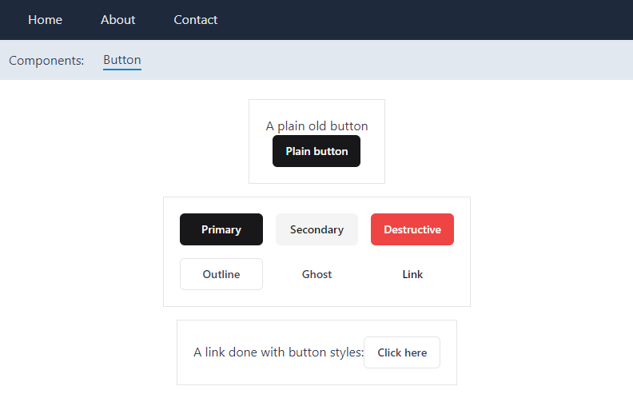

# solid-issues/solid-sek

This is a solid-start project designed to validate parts of
sek-consulting's solid-ui.



Created with:

```
solidui-cli@latest init
# with tailwind

pnpm dlx solidui-cli@latest init
# all defaults, and pnpm

pn dlx solidui-cli@latest add button

```
